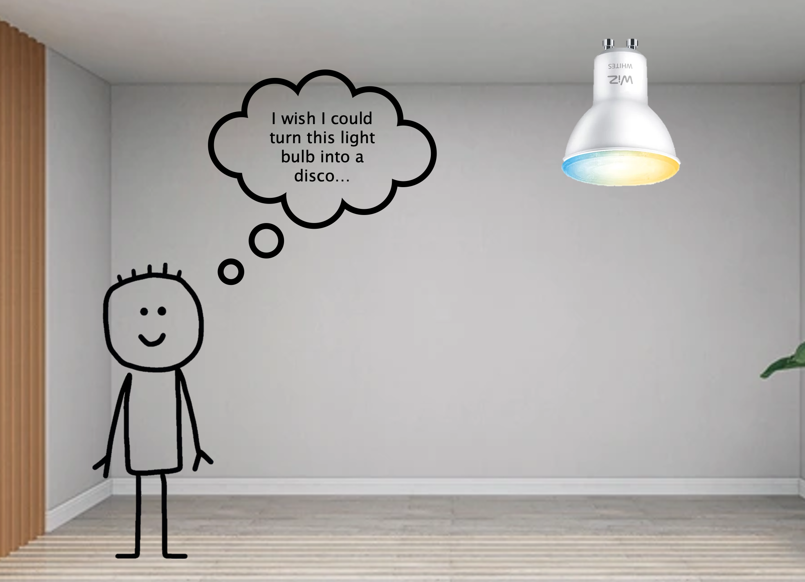

# 🔆 WiZ Light Controller

A modern desktop application for discovering and controlling [WiZ smart lights](https://www.wizconnected.com/en-gb/products/bulbs) on your local network.

Built with:


> Born from the need for a simple, native desktop app to control WiZ lights without the hassle of browser limitations or server setup.



^ not ai generated :)

## 📸 Demo


## ✨ Features

- 🔍 **Auto-Discovery**: Automatically discover WiZ lights on your network (works even when lights are turned off)
- 💡 **Complete Light Control**: Power, brightness, RGB colors, and color temperature
- 🎨 **Advanced Color Tools**: HTML5 color picker and random color generator with input-only behavior
- ✏️ **Custom Names**: Editable light names with persistent storage
- 🌙 **Modern Dark UI**: Clean, minimal interface with smooth animations
- 🖥️ **Native Desktop App**: Cross-platform Electron application with direct UDP networking
- ⚡ **Real-time Updates**: Live status monitoring and responsive controls
- 🎛️ **Smart UI**: Input-only sliders and color picker prevent feedback loops for smooth interaction

## 🚀 Installation

### Prerequisites

- **Node.js** (v18 or later)
- **npm** (v9 or later)
- **WiZ lights** connected to the same network

### Setup

1. **Clone the repository**

```bash
git clone https://github.com/TomSB1423/wizLightController.git
cd wizLightController
```

2. **Install dependencies**

```bash
npm install
```

3. **Run the application**

```bash
npm run electron-dev
```

### Production Build

```bash
# Build for production
npm run build

# Create executable
npm run pack

# Create installer
npm run dist
```

## 📖 Usage

1. Launch the application
2. Click "Discover Lights" to find WiZ lights on your network
3. Control your lights using the intuitive interface:
   - Toggle power with the switch
   - Adjust brightness with the slider
   - Change colors using RGB sliders or color picker
   - Randomize colors with one click
   - Edit light names by clicking on the title

## 🤝 Contributing

Here's how you can help:

### Getting Started

**Fork the repository** and submit a pull request with your changes!

### Development Guidelines

- **Code Style**: Follow existing TypeScript and Angular conventions
- **Commits**: Use clear, descriptive commit messages
- **Testing**: Test your changes thoroughly with actual WiZ lights
- **Documentation**: Update documentation for new features

### Submitting Changes

### Areas for Contribution

- 🐛 **Bug Fixes**: Report and fix issues
- ✨ **New Features**: Light scheduling, scenes, groups
- 🎨 **UI/UX**: Design improvements and accessibility
- 📚 **Documentation**: Improve guides and examples
- 🧪 **Testing**: Add automated tests
- 🌍 **Localization**: Multi-language support

## 🐛 Troubleshooting

**No lights found?**

- Ensure lights are on the same network
- Check firewall settings for UDP port 38899
- Verify lights are powered (they can be discovered when off)

**App won't start?**

- Update Node.js and npm to latest versions
- Try `npm install` again
- Check for port conflicts

## 📄 License

This project is licensed under the MIT License - see the [LICENSE](LICENSE) file for details.

## 🙏 Acknowledgments

- [WiZ Connected](https://www.wizconnected.com/) for the smart light protocol
- [Angular Team](https://angular.io/) for the excellent framework
- [Electron](https://electronjs.org/) for cross-platform desktop development

---
